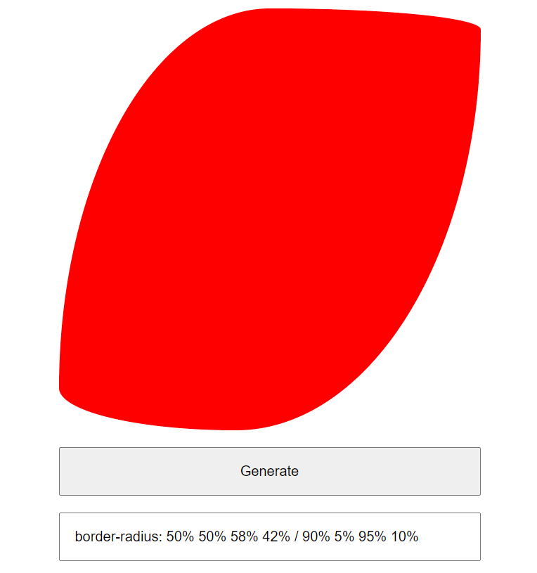
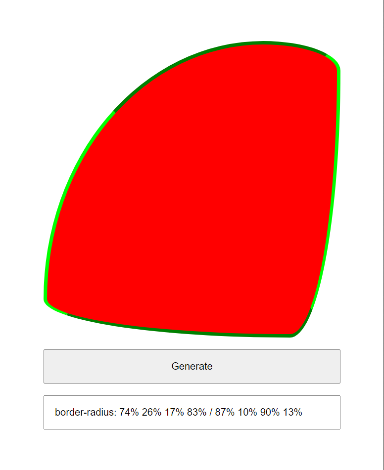
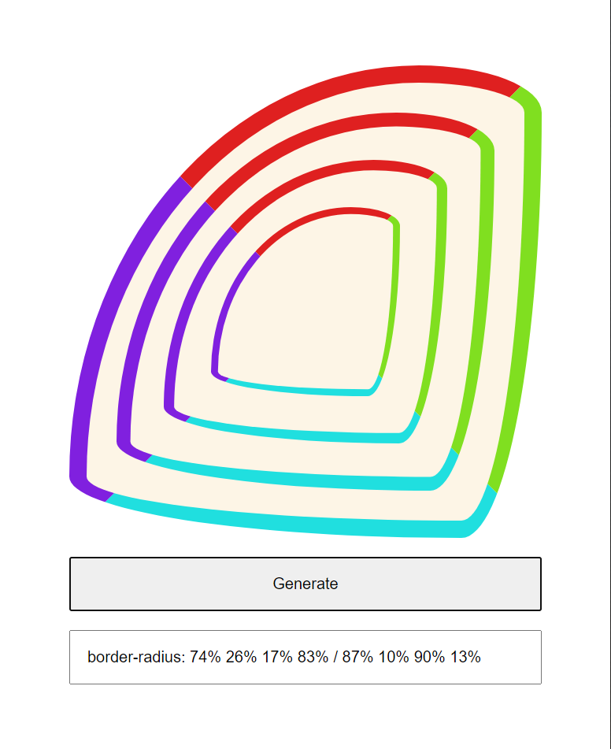
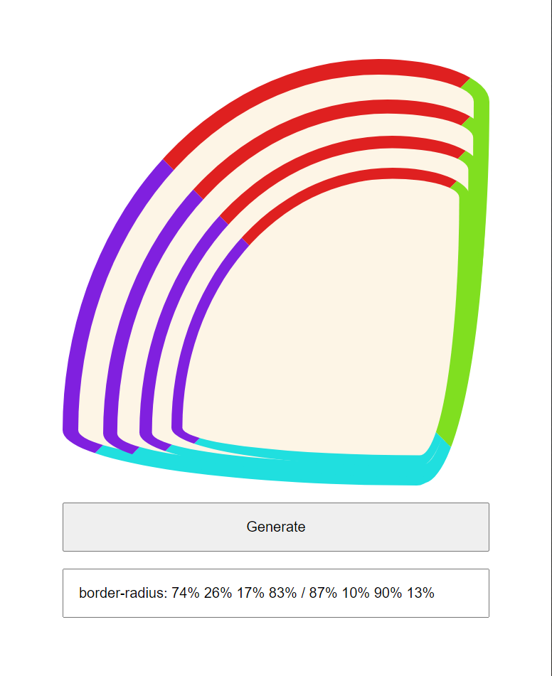
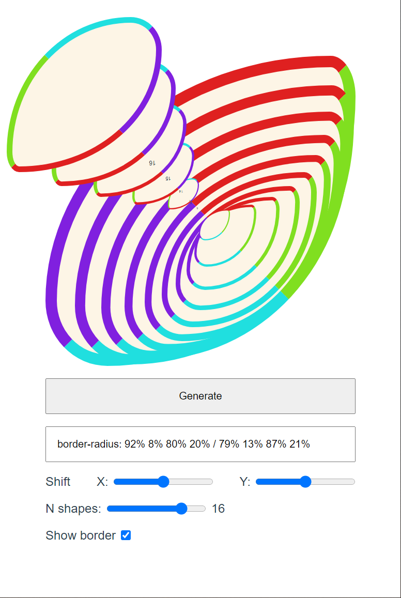
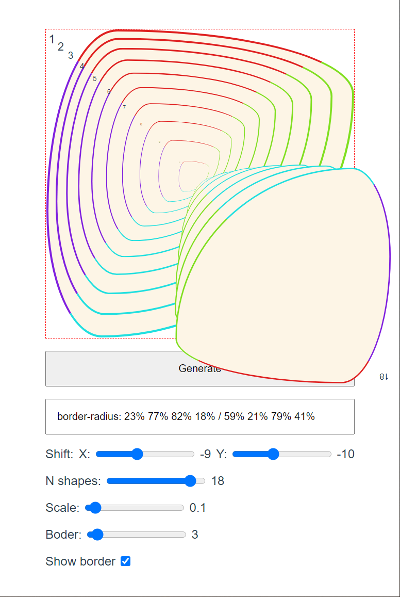
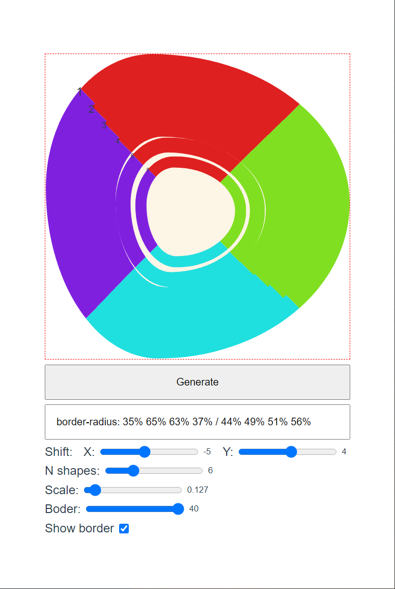
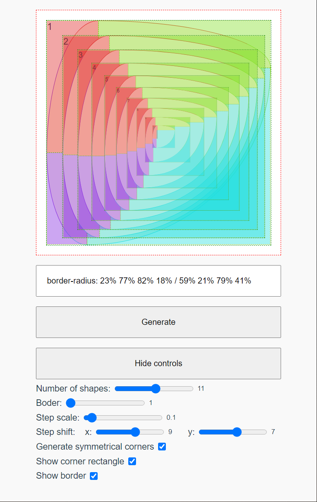
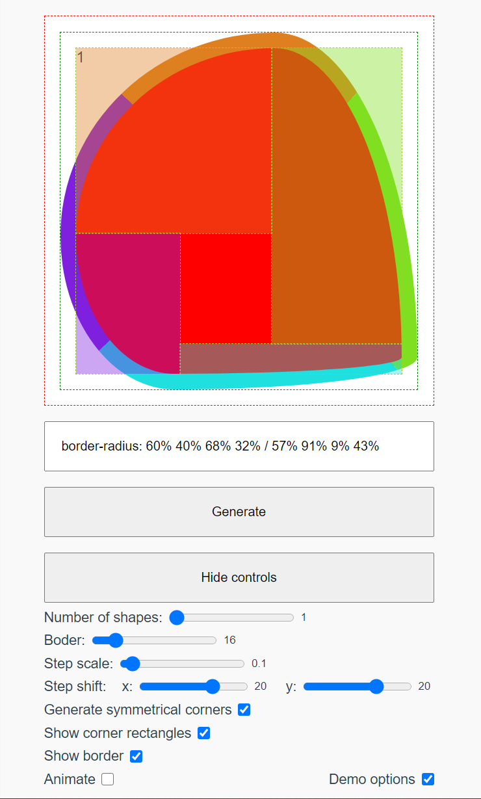
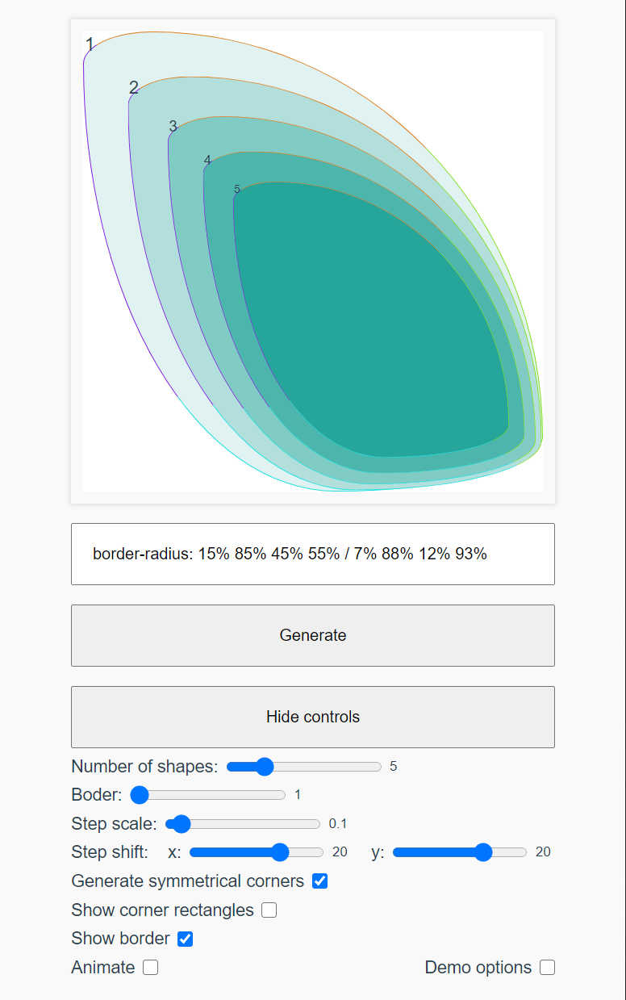

#### About

Simplest border radius generator.

 a | b | c
-----|-----|---
 |  | 
 |  | 
 |  | 
 |  | 

#### Links, references, credits

* [Original Vue.js project code](https://github.com/maxzz/border-radius-generator)
* [Original Vue.js project demo](https://maxzz.github.io/border-radius-generator)
